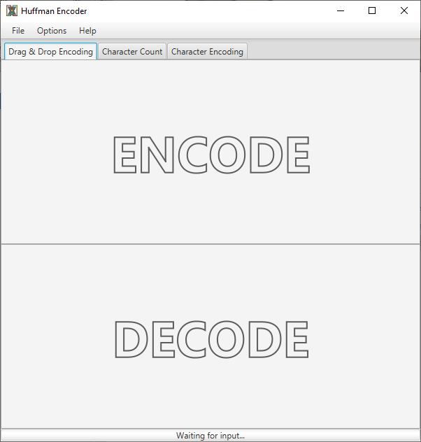

# Huffman Encoder
This is a project that implements Huffman encoding/decoding with Java. Additionally, this project is tied to a GUI  that was designed with JavaFX. Users can encode/decode files via drag and drop or through the file explorer. Furthermore, the count and encodings of byte signatures are viewable to the user.

## Details
* Prepends tree to the encoded file.
* Signature is two bytes long.
* Uses buffered input/output for faster processing.
* Errors are reported to the user through the GUI.

## Output

